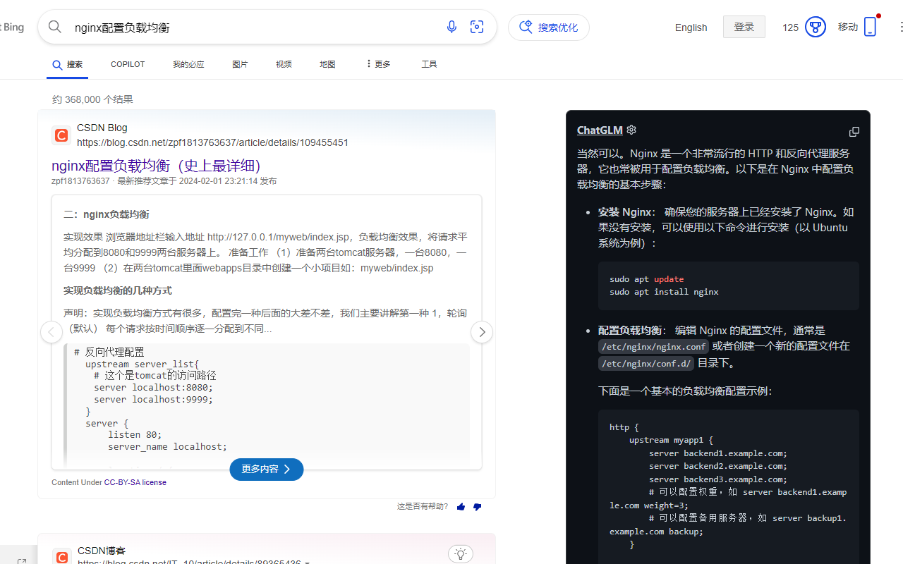
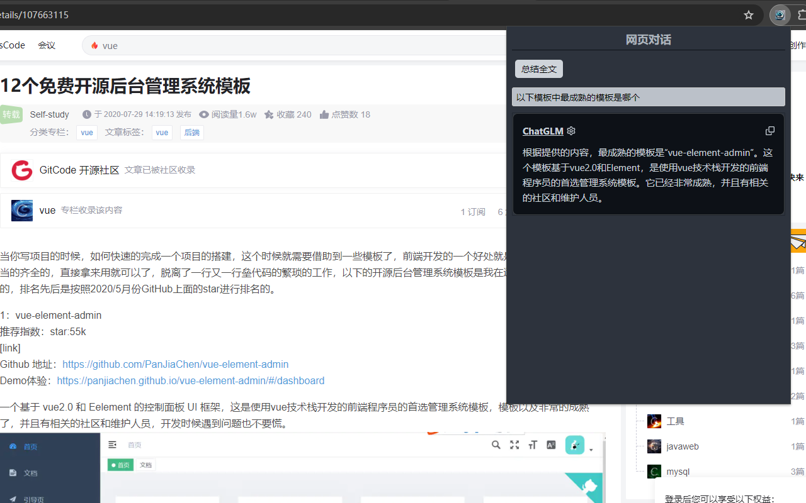

# 说明
项目说明: 使用主流搜索引擎搜索的时候, 同时使用ChatGLM大语言模型在搜索页旁生成结果的chrome插件

基于项目: [chatgpt-google-extension](https://github.com/wong2/chatgpt-google-extension)

修改: 替换大语言模型ChatGPT为国产ChatGLM,解决国内网络访问问题. 添加网页聊天功能,根据网页内容进行聊天

使用前提: 访问[ChatGLM](https://chatglm.cn/)网站并登陆

离线安装:
1.安装依赖包: npm install, 
2.构建: npm run build, 
3.加载插件: 浏览器打开chrome://extensions/, 打开开发者模式, 点击加载已解压的扩展程序, 选择build文件夹

功能截图:

搜索页面答案生成

网页对话

